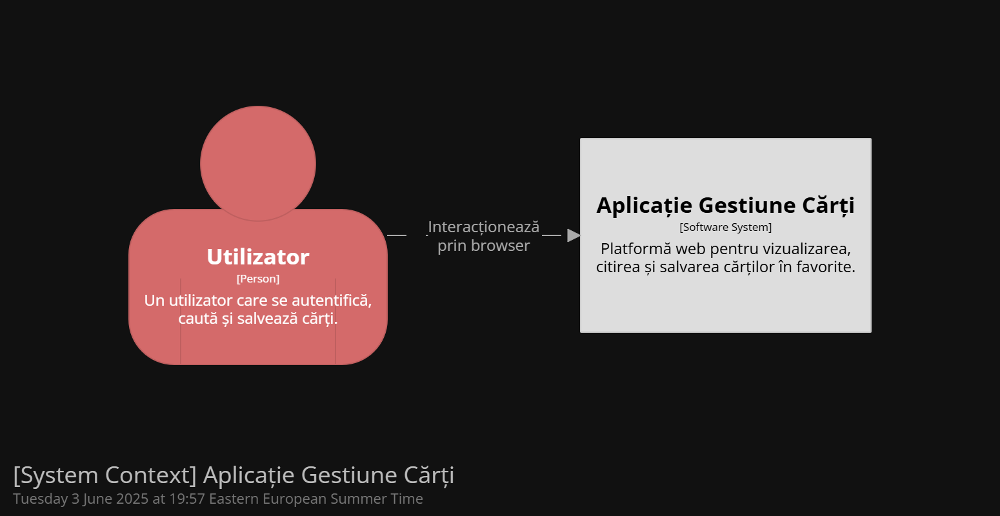
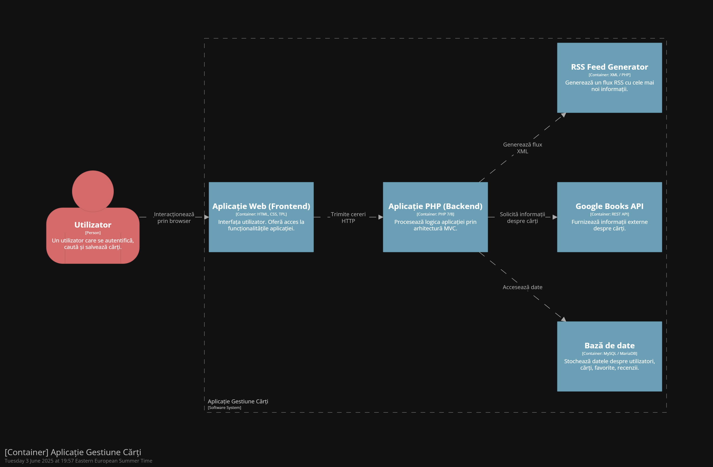

# WebInfoAn2SpilevoiAnton

Proiect TW Uaic info an 2 sem 2 Spilevoi Bogdan si Anton Cosmin

# Link Demonstratie (unlisted, a se apăsa pentru vizionare):

# Prezentare Arhitectură - Aplicație Gestiune Cărți 

Books on Web

Acest document oferă o prezentare de ansamblu asupra arhitecturii aplicației web pentru gestionarea cărților și favoritelor, inspirată de modelul C4 (Context, Container, Component, Code).

---

## 📌 Nivel 1 - Context

Aplicația este o platformă web prin care utilizatorii pot:
- vizualiza cărți (din baza locală sau din Google Books),
- salva cărți în lista de favorite,
- citi cărți și urmări progresul,
- scrie recenzii,
- accesa fluxuri RSS,
- gestiona contul propriu.

**Stakeholderi principali**:
- ✅ Utilizator autenticat
- 🔐 Administrator
- 🌐 Serviciul extern Google Books API

---

## 🧱 Nivel 2 - Container

Arhitectura este construită pe modelul **MVC (Model-View-Controller)** și include următoarele containere logice:

| Container     | Rol principal                                  | Limbaj / Tehnologie         |
|---------------|------------------------------------------------|-----------------------------|
| **Frontend**  | Interfața utilizator (HTML, CSS)               | HTML + TPL + CSS            |
| **Backend**   | Logica aplicației și gestionarea datelor       | PHP                         |
| **Bază de date** | Persistența datelor (cărți, utilizatori etc.) | Postgres                  |
| **API extern**| Serviciul Google Books                         | REST API JSON               |

---

## ⚙️ Nivel 3 - Componente

Aplicația este organizată în componente după modelul MVC:

### ✅ Controllere (`controller*.php`)
- `controllerauth.php` – autentificare, logare
- `controllerbook.php` – listare, căutare, detalii carte
- `controllerhome.php` – homepage cu overview
- `controllersettings.php` – gestionarea setărilor

### 🧠 Modele (`model*.php`)
- Conțin logica de acces și manipulare a datelor pentru cărți, conturi, setări, recenzii etc.

### 🎨 View-uri (`*.tpl`)
- Interfață HTML pentru utilizator.
- Pagini precum `home.tpl`, `auth.tpl`, `book.tpl`, `settings.tpl`.

### 🔌 API intern (`*.php`)
- `/api/favorite` – adaugă cărți la favorite
- `/api/read` – marchează progresul citirii
- `/api/rss` – oferă feed XML
- `/api/review` – trimite recenzii

---

## 🔎 Nivel 4 - Cod sursă

Logica este împărțită în clase și funcții cu responsabilități clare, respectând principiile separării preocupărilor. Exemple:
- `ModelBook::getAllBooks()`
- `ModelAuth::validateLogin($user, $pass)`
- `ViewHome::render($data)`

---

## 🔐 Securitate
- Parole criptate
- Validare input server-side
- Sesiuni PHP pentru autentificare
- Exportul datelor doar pentru userul logat

---

## 📦 Tehnologii utilizate

- PHP 8
- Postgres
- HTML5 + CSS
- Scholarly HTML (pentru documentație)
- Google Books API (REST)
- RSS (XML feed)

---

## 🧭 Diagrame

---

## 📌 Concluzie

Aplicația este construită modular, extensibilă și separă clar preocupările între interfață, logică și date. Arhitectura bazată pe MVC și principii inspirate din Modelul C4 asigură claritate, mentenabilitate și scalabilitate.

